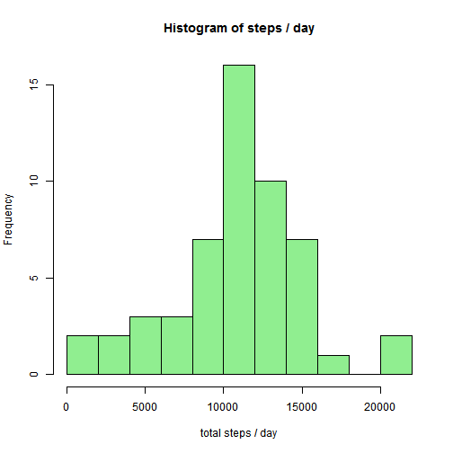
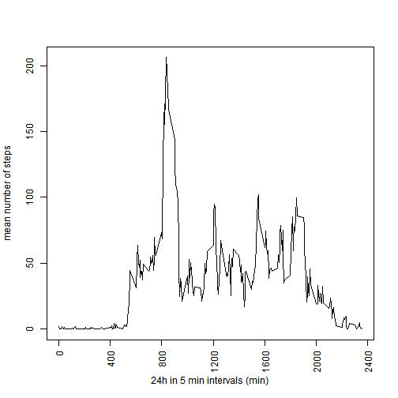
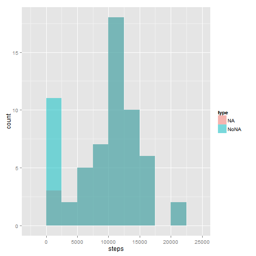
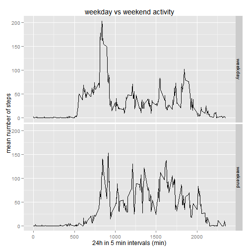

RepData_PeerAssesment 1
=========
Author: Edolas  
Date: 11Feb15  

First the data is loaded into R as a data table and the date vector is converted to a date format.


```r
data <- read.csv("activity.csv")
data$date <- as.Date(data$date, "%Y-%m-%d")
```

##What is the mean total number of steps taken per day?
To answer this the data are summed by day and a histogram is plotted.


```r
stepsum <- aggregate(steps ~ date, data=data, FUN=sum)
hist(stepsum$steps, xlab = "total steps / day", main = "Histogram of steps / day", col = "lightgreen", breaks = 10)
```

 

Now we can also generate the mean and median of the total number of steps taken each day.

```r
mean(stepsum$steps)
```

```
## [1] 10766.19
```

```r
median(stepsum$steps)
```

```
## [1] 10765
```

##What is the average daily activity pattern?
Now the data is aggregated by the interval instead of the day to answer the daily activity pattern.


```r
timesum <- aggregate(steps ~ interval, data=data, FUN=mean)
plot(timesum$interval, timesum$steps, type = "l", ylab = "mean number of steps", xlab = "24h in 5 min intervals (min)", xaxt="n")
axis(1,at = seq(0, 2400, by= 400), las = 2)
```

 

And to find where the maximum number of steps is taken on average across all the days in the dataset


```r
timesum[which.max(timesum$steps),]
```

```
##     interval    steps
## 104      835 206.1698
```

##Imputing missing values

First we look up the number of missing values.


```r
sum(is.na(data))
```

```
## [1] 2304
```

It is assumed the NAs are derived from moments when there is no movement and thus the NAs are replaced with zeros.


```r
dataNoNA <- data
dataNoNA[is.na(dataNoNA)] <- 0
```

In order to compare this data to the previous dataset they are combined with the original data in a new dataset. This is then plotted together in an overlay histogram to see which bins show a difference.


```r
stepsumNoNA <- aggregate(steps ~ date, data=dataNoNA, FUN=sum)
        stepsum$type <- "NA"
        stepsumNoNA$type <- "NoNA"
        Totalsum <- rbind(stepsum, stepsumNoNA)
library(ggplot2)
        ggplot(Totalsum, aes(steps, fill = type)) + geom_histogram(alpha = 0.5, position = 'identity', binwidth = 2500)
```

 

It is evident that the bin with 0 steps a day has increased a lot. Apparently there are some days with only NA values which now appear in the graph.

lets see what this means for the mean and median values of the data.


```r
mean(stepsumNoNA$steps)
```

```
## [1] 9354.23
```

```r
median(stepsumNoNA$steps)
```

```
## [1] 10395
```

Clearly these values have decreased from the original dataset, with the largest influence on the mean, which is known to be more sensitve to outliers than the median.

##Are there differences in activity patterns between weekdays and weekends?

Now we add the weekdays by creating a new vector with weekday indexes (0-6) and replacing them with either weekend or weekday. This index can then be used in ggplot to make a panel plot.


```r
dataNoNA$wday <- as.POSIXlt(data$date)$wday
           dataNoNA$wday[dataNoNA$wday > 0 & dataNoNA$wday <6] <- "weekday"
           dataNoNA$wday[dataNoNA$wday == 0 | dataNoNA$wday == 6] <- "weekend"
timesumNoNA <- aggregate(steps ~ interval + wday, data=dataNoNA, FUN=mean)
qplot(interval, steps, data=timesumNoNA
      , geom="line"
      , main = "weekday vs weekend activity"
      , ylab = "mean number of steps"
      , xlab = "24h in 5 min intervals (min)"
      , facets=wday~.)
```

 

It is clear from this graph that the weekend activity starts around 8 AM instead of 5 AM on weekdays.Furthermore activity during the day is higher with several events with a mean number of steps above 100, whereas this is never the case on a weekday. Activity is somwhat lower around 7 PM in the weekend (weekday commute?), but extends longer till 9 PM instead of 7 PM.
